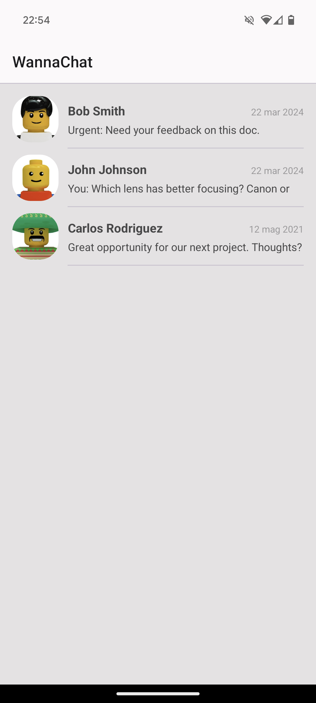

# ChatApp

## Screenshots 

  
  
  

        

## Tech stack & open-source libraries
- Min SDK level 24
- [Retrofit](https://github.com/square/retrofit)
- [Gson]()
- [Glide]()
- [Hilt]() 
- [Material Design 3](https://m3.material.io/)
