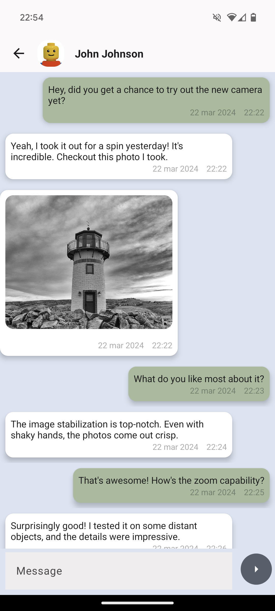
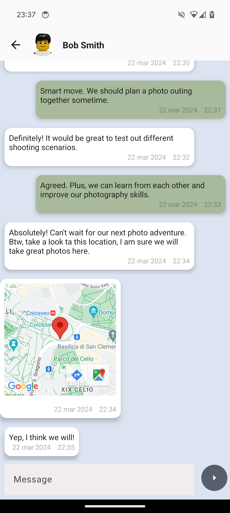

# WannaChat

Chat app interface that allows users to view chats and engage in conversation.
Currently, this project focuses solely on the frontend part and uses kotlin coroutines functions 
along with elements of clean architecture.

Also have:
- Dependency Injection with Hilt Dagger
- Unit tests fot the ViewModels

## Screenshots 
<div class="row">
  
  
  
  
</div>        

## Setup

create your [google maps api key](https://developers.google.com/maps/documentation/android-sdk/get-api-key?hl=it)  and add it to `local.properties`
```
google_maps_api_key=YOUR_GOOGLE_MAPS_API_KEY
```

## Tech stack & open-source libraries
- Min SDK level 24
- [Retrofit](https://github.com/square/retrofit)
- [Gson](https://github.com/google/gson)
- [Parcelize](https://plugins.gradle.org/plugin/org.jetbrains.kotlin.plugin.parcelize)
- [Glide](https://github.com/bumptech/glide)
- [Hilt](https://dagger.dev/hilt/) 
- [Material Design 3](https://m3.material.io/)
- [Maps Play Services](https://developers.google.com/maps?hl=it)

## What's next?

Soon, this project will evolve into a fully functional chat app with a __backend powered by Firebase.__
